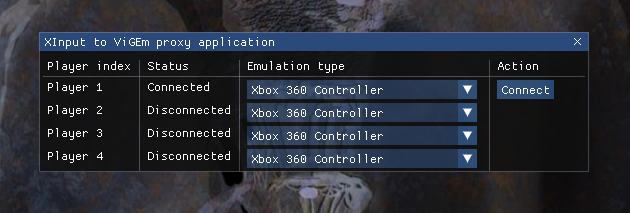

# XInput/x360ce to ViGEm sample application

Adds ViGEm support to Xbox 360/One controllers and unmodified x360ce (v3.x) application.

    

## Downloads

👉 [Grab the highest version from here](https://buildbot.vigem.org/builds/VDX/master/).

## How to use

Make sure ViGEmBus is installed. Then simply launch VDX. Plug in one or more Xbox 360 or One-comparible controller(s), select the desired output emulation and press `Connect`. The controller inputs should now be mirrored on a newly created virtual controller.

## How to build

### Prerequisites

- Visual Studio **2019** ([Community Edition](https://www.visualstudio.com/thank-you-downloading-visual-studio/?sku=Community&rel=16) is just fine)

## 3rd party credits

- [Simple and Fast Multimedia Library](https://www.sfml-dev.org/)
- [dear imgui](https://github.com/ocornut/imgui)
- [ImGui + SFML](https://github.com/eliasdaler/imgui-sfml)
